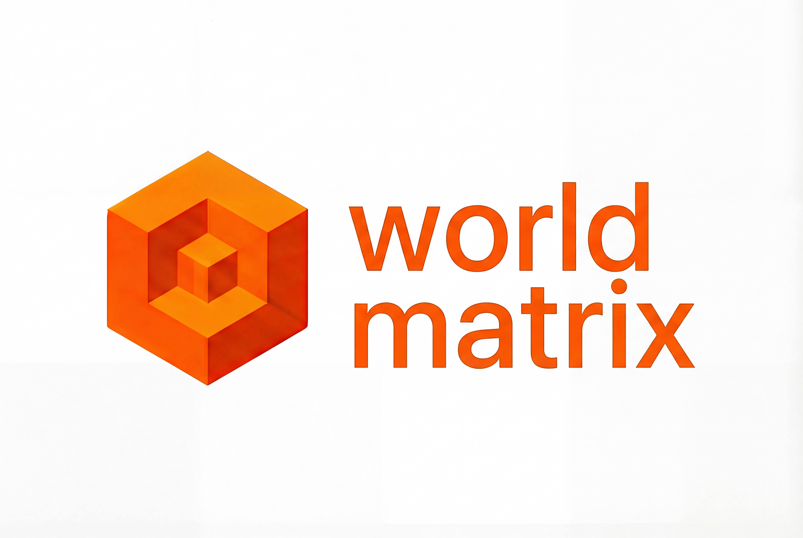

<p align="center">
  
</p>

# worldmatrix

Open infrastructure for optimized 3D worlds. WorldMatrix builds fast, streamable asset outputs and provides 
runtime loaders/viewers for web apps.

WMX is built on the [Khronos glTF 2.0 specification](https://www.khronos.org/gltf/) (glTF/GLB) plus a `.wmx` manifest layer for
variant + streaming metadata. The pipeline uses [glTF-Transform](https://gltf-transform.dev/) and optionally
[KTX-Software](https://github.com/KhronosGroup/KTX-Software) for KTX2/BasisU.

## Three.js integration (minimal)

```ts
import { GLTFLoader } from 'three/examples/jsm/loaders/GLTFLoader.js';
import { WMXLoader } from '@worldmatrix/wmx-three';

const wmx = new WMXLoader(new GLTFLoader());
const gltf = await wmx.load('/wmx/my-asset/asset.wmx.json', { quality: 'medium' });
scene.add(gltf.scene);
```

For KTX2 output, configure `KTX2Loader` and pass it to `WMXLoader` (or use `@worldmatrix/wmx-runtime`).

For an imperative runtime setup, see:
- `workflows/integrations/three-imperative.md`

## R3F / React integration (minimal)

```tsx
import { WMXModel } from '@worldmatrix/wmx-r3f';

export function ModelCard() {
  return <WMXModel manifestUrl="/wmx/my-asset/asset.wmx.json" quality="medium" />;
}
```

For custom app integrations, see:
- `workflows/integrations/r3f.md`
- `workflows/integrations/nextjs.md`

## Dashboard + generation (quickstart)

### Local (CLI + dashboard)

```bash
npm install
npm run build

# Build one WMX asset
INPUT_GLB="/path/to/model.glb"
node packages/wmx-cli/dist/cli.js build "$INPUT_GLB" --out ./dist --name my-asset

# Run dashboard in local mode
npm run dev -w dashboard
```

Open `http://localhost:5173`, switch to local mode if needed, and pick your output folder.

### Docker self-host (dashboard + asset-server)

```bash
./scripts/run-compose.sh
```

Then open:

- Dashboard: `http://localhost:3000`
- Asset server: `http://localhost:8080`

In dashboard server mode:

1. Upload one or more `.glb` files.
2. Build selected/all.
3. Inspect variants, stats, and streaming metadata.
4. Use Benchmark view for multi-asset testing (`?wmxDebug=1` for verbose streaming logs).

## WMX layout (v1)

Typical output:

```text
dist/<assetNameOrId>/
  asset.wmx.json
  variants/ultraLow.glb
  variants/low.glb
  variants/medium.glb
  variants/high.glb
  artifacts/stats.json
  artifacts/thumbnail.png   (optional)
  tiles/...                 (when streaming stage 2 is enabled)
```

## Streaming schema (canonical)

Streaming metadata lives at `manifest.streaming` (schema: `wmx-streaming-refine-tree@1`).
See `docs/spec/streaming-v1.md`.

## Benchmark/debug notes

- Add `?wmxDebug=1` to dashboard URL to enable verbose benchmark logs.
- Benchmark mode supports:
  - multi-asset scene
  - transform gizmo (translate/rotate/scale)
  - retention mode (`cache`/`dispose`)
  - dispose threshold (`disposeOutOfFrustumFrames`)

## Workflows

See [workflows/README.md](workflows/README.md) for copy/paste runbooks.

## Release/versioning

- User-facing changes are tracked in [CHANGELOG.md](CHANGELOG.md) under `Unreleased`.
- Streaming/culling behavior remains marked experimental where noted in docs.

## Stability policy (Milestone 1)

- **Stable now**:
  - `asset.wmx.json` core contract (`schemaVersion`, `assetId`, `variants`, `artifacts`, `streaming` field shape)
  - CLI build outputs and folder conventions
  - Basic Three.js/R3F loading path (`WMXLoader`, `WMXModel`, `WMXStreamingTileset`)
- **Experimental**:
  - Advanced streaming runtime heuristics (dispose/culling edge behavior, occlusion tuning)
  - Benchmark-mode runtime controls used for diagnostics
